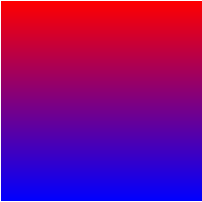
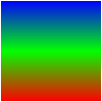
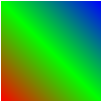
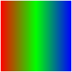
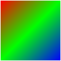

## CSS3 渐变 (Gradients)
> ### CSS3 定义了两种类型的渐变（gradients）：
1. 线性渐变（Linear Gradients）- 向下/向上/向左/向右/对角方向
2. 径向渐变（Radial Gradients）- 由它们的中心定义
#### 注意： IE 9 及之前的版本不支持渐变。
> ### 线性渐变：
- `background: linear-gradient(direction, color-stop1, color-stop2, ...);`
#### 1. 线性渐变 - 从上到下（默认情况下）:
```
.box {
  background: -webkit-linear-gradient(red, blue);   /* Safari 5.1 - 6.0 */
  background: -o-linear-gradient(red, blue);        /* Opera 11.1 - 12.0 */
  background: -moz-linear-gradient(red, blue);      /* Firefox 3.6 - 15 */
  background: linear-gradient(red, blue);           /* 标准的语法(必须放在最后) */
}
```
> 效果图 
#### 2. 线性渐变 - 从左到右
```
.box {
    height: 50px;
    background: -webkit-linear-gradient(left, red , blue);  /* Safari 5.1 - 6.0 */
    background: -o-linear-gradient(right, red, blue);       /* Opera 11.1 - 12.0 */
    background: -moz-linear-gradient(right, red, blue);     /* Firefox 3.6 - 15 */
    background: linear-gradient(to right, red , blue);      /* 标准的语法（必须放在最后） */
}
```
> 效果图 
#### 3. 线性渐变进阶
```
.box{
    height: 100px;
    width: 100px;
    background: -webkit-linear-gradient(0deg,#FF0000 0%,#00FF00 50%,#0000FF 100%);
    background: -o-linear-gradient(0deg,#FF0000 0%,#00FF00 50%,#0000FF 100%);
    background: -moz-linear-gradient(0deg,#FF0000 0%,#00FF00 50%,#0000FF 100%);
    background: linear-gradient(0deg,#FF0000 0%,#00FF00 50%,#0000FF 100%);
}
```
> 效果图 

> 没错，就是通过角度来空值渐变的起始位置：
- 45deg 效果图 
- 90deg 效果图 
- 135deg 效果图 

*由此，我们知道了起始可以通过角度来获得我们想要的线性渐变的各种效果了，这基本能满足我们大多数 的需求了。*
